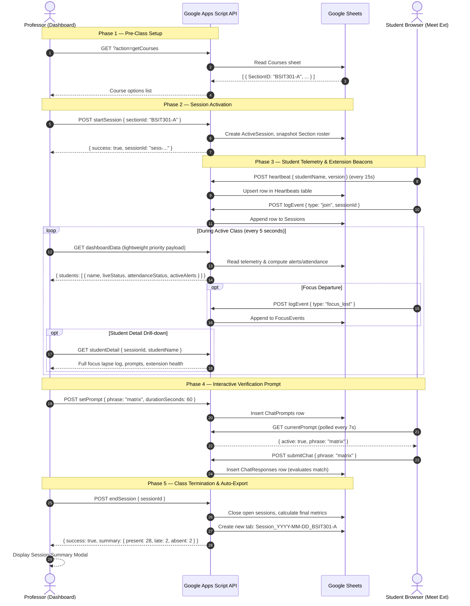

# System Architecture

## Overview

**Kuwago** is a distributed classroom engagement and attendance monitoring system for Google Meet. It operates across three decoupled layers:

| Layer | Host Environment | Core Responsibility |
|---|---|---|
| **Chrome Extension** | Student Chrome Browser (Manifest V3) | Captures tab/window focus, Meet display name, chat responses, and sends periodic health heartbeats. |
| **Apps Script Backend** | Google Cloud (Apps Script Web App) | Central API router, business logic (attendance, focus lapses, participation, alerts), and Google Sheets ORM. |
| **Professor Dashboard** | Professor Desktop / Browser | Zero-build Vanilla ES Modules SPA displaying the live Priority Roster, prompt dispatcher, and session controls. |
| **Storage Engine** | Google Sheets | Tabular database storing reference rosters, real-time telemetry, prompts, and compiled per-session reports. |

---

## Data Flow & Lifecycle

### Complete Session Lifecycle Sequence

---

## Component Architecture

### 1. Professor Dashboard (`index.html`, `js/`, `css/`)

A client-side Single Page Application engineered with zero third-party framework dependencies.

- **`js/app.js`**: Application bootstrapper. Orchestrates the 5-second polling loop, tab switching, and binds navigation controls.
- **`js/session.js`**: Controls class lifecycle. Manages course selection, triggers `startSession` and `endSession`, runs the live session duration timer, and opens the session summary report.
- **`js/attendance.js`**: Handles manual professor attendance overrides (`overrideAttendance`) and alias binding (`resolveMatch`) for students whose Meet display names do not match the roster.
- **`js/render.js`**: Ultra-fast DOM renderer. Paints the Priority Roster, student alert indicators, attendance status badges, active prompt counters, and renders the lazy-loaded Student Detail modal.
- **`js/prompt.js` & `js/respondents.js`**: Prompt issuance modal, countdown timer ticker, and live respondents checklist.
- **`js/api.js`**: Fetch wrapper featuring configurable request timeouts, automatic error recovery, and last-known-good state preservation.
- **`js/mock.js`**: Offline sandbox engine. Enabled via `?mock=true`, simulating every backend endpoint, telemetry jitter, and edge cases without external connections.

### 2. Chrome Extension (`chrome-extension/`)

A Manifest V3 extension operating strictly within student browser sessions on `meet.google.com`.

- **`manifest.json`**: Configured with `activeTab`, `scripting`, `tabs`, and `host_permissions` for Google Meet and the Apps Script endpoint.
- **`content.js`**:
  - Automatically identifies the student's own display name from Google Meet's participant tile DOM using multi-tiered CSS selector fallbacks.
  - Monitors the in-meeting chat box using a `MutationObserver` to capture outgoing text and verify prompt compliance.
  - Dispatches visual in-page prompt notifications when the professor issues a verification phrase.
- **`background.js`**:
  - Combines `chrome.tabs.onActivated` and `chrome.windows.onFocusChanged` with a 1,500ms debounce buffer to reliably distinguish brief window flicks from genuine sustained departures.
  - Fires heartbeat pulses every 15 seconds to report extension connectivity and version health.
  - Automatically detects when a student closes or navigates away from the Google Meet tab to log leave timestamps.

### 3. Google Apps Script Backend (`apps-script/`)

The serverless API engine executing on Google infrastructure.

- **`Code.gs`**: Central `doGet` and `doPost` router. Dispatches endpoints for session lifecycle, roster aggregation, prompt handling, and compiles the post-session consolidated spreadsheet tab.
- **`SheetHelpers.gs`**: Data layer abstractions. Implements CRUD operations, name normalization, and includes `setupSheets()` for one-click database initialization.
- **`Engagement.gs`**: Analytical computing core. Computes focus lapses, evaluates sustained unfocus alerts, scores participation rates, and determines attendance states.

---

## Google Sheets Database Schema

Google Sheets acts as a relational-style datastore comprising seven standard tables plus dynamic per-session export tabs.

### 1. `Courses`
Reference table for academic sections.
| Column | Type | Description |
|---|---|---|
| `SectionID` | string | Primary key (e.g. `BSIT301-A`) |
| `CourseName` | string | Full subject title (e.g. `IT Capstone Project`) |
| `SectionName` | string | Section descriptor (e.g. `Section A`) |

### 2. `Students`
Official roster table. Lookups are scoped by `SectionID`.
| Column | Type | Description |
|---|---|---|
| `StudentName` | string | Canonical student name (`LastName, FirstName, M.I.`) |
| `SectionID` | string | Foreign key referencing `Courses.SectionID` |

### 3. `Sessions`
Log of student presence per class session.
| Column | Type | Description |
|---|---|---|
| `SessionID` | string | Unique session identifier |
| `StudentName` | string | Normalized student name |
| `Matched` | boolean | `TRUE` if matched to canonical roster, `FALSE` for raw Meet names |
| `JoinTime` | ISO datetime | First arrival timestamp |
| `LeaveTime` | ISO datetime | Departure timestamp (or session close timestamp) |

### 4. `FocusEvents`
Audit trail of window and tab focus transitions.
| Column | Type | Description |
|---|---|---|
| `EventID` | string | Unique event identifier |
| `StudentName` | string | Student display name |
| `SessionID` | string | FK referencing `Sessions.SessionID` |
| `Type` | string | `lost` (away from Meet) or `regained` (returned to Meet) |
| `Timestamp` | ISO datetime | Exact timestamp of focus transition |

### 5. `ChatPrompts`
History of interactive verification prompts broadcast by the professor.
| Column | Type | Description |
|---|---|---|
| `PromptID` | string | Unique prompt identifier |
| `ExpectedPhrase`| string | Normalized case-insensitive phrase |
| `IssuedAt` | ISO datetime | Broadcast timestamp |
| `ExpiresAt` | ISO datetime | Deadline timestamp |
| `IsActive` | boolean | `TRUE` if prompt is currently accepting answers |

### 6. `ChatResponses`
Incoming student chat submissions evaluated against prompts.
| Column | Type | Description |
|---|---|---|
| `ResponseID` | string | Unique response identifier |
| `StudentName` | string | Submitting student name |
| `PromptID` | string | FK referencing `ChatPrompts.PromptID` |
| `SubmittedText` | string | Raw text entered by student in Meet chat |
| `Matched` | boolean | Whether submitted text met prompt criteria |
| `Timestamp` | ISO datetime | Submission timestamp |

### 7. `Heartbeats`
Latest-only health beacon table (one row per student, continuously overwritten).
| Column | Type | Description |
|---|---|---|
| `StudentName` | string | Primary key (student name) |
| `DetectedName` | string | Raw name detected in Meet DOM |
| `ExtensionVersion` | string | Client version (e.g. `2.0.0`) |
| `Timestamp` | ISO datetime | Timestamp of most recent heartbeat |

---

## Compiled Session Sheet: `Session_YYYY-MM-DD_SectionID`

When a session concludes via `endSession`, Kuwago generates a frozen, permanent spreadsheet tab formatted as `Session_YYYY-MM-DD_SectionID` (e.g. `Session_2026-09-11_BSIT301-A`).

### Columns:
1. **Student Name**: Canonical roster name.
2. **Attendance Status**: `Present`, `Late`, `Absent`, or `Excused` (incorporates manual overrides).
3. **Join Time**: Arrival timestamp.
4. **Leave Time**: Departure timestamp.
5. **Focus Lapses**: Number of sustained departures exceeding threshold.
6. **Total Away Time**: Cumulative time away from Meet (formatted as `Xm Ys`).
7. **Participation**: Fraction of answered verification prompts (e.g. `3 / 3`).
8. **Notes / Overrides**: Audit notes detailing any professor adjustments and reasons.

---

## Analytics & Behavioral Models

### 1. Focus Lapses vs. Legacy Attentiveness %

Kuwago v2.0.0 replaced arbitrary percentage calculations with **Focus Lapses**:
- **Definition**: A focus lapse is registered only when a student remains unfocused from Google Meet for longer than the sustained unfocus alert threshold (default: 45 seconds).
- **Transient Filtering**: Brief tab flicks (< 1.5s) are filtered at the extension layer; brief reference checks (< 45s) do not increment lapse counts.
- **Reporting**: Displayed as a count alongside cumulative away duration (e.g. `2 lapses · 3m 40s away`). Clean students show `No focus lapses`.

### 2. Attendance Classification Engine

Attendance status is resolved automatically:
- **`Present`**: Joined within the configured grace period (default: 15 minutes from session start).
- **`Late`**: Joined after the grace period has expired.
- **`Absent`**: No join event recorded during the active session window.
- **`Excused`**: Assigned via manual professor override with documented reason.
